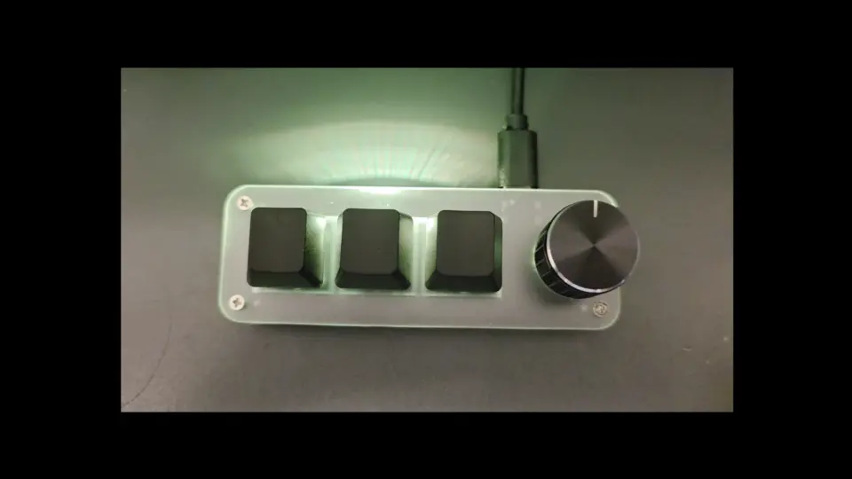

# Rologlyphex



A Rust GTK4 overlay daemon and Unicode input synthesizer for macropads. A rotary knob cycles through decks of character palettes; a floating overlay shows the active deck and what each button types. Pressing a button types the Unicode character into the focused window via XTest.

Named after Rolodex + glyphs.

## Features

- **Layer overlay** — floating, click-through notification window shows the active deck and per-button glyphs as the knob cycles, with an app header (icon + title) that hugs the configured corner; recall on demand via `rologlyphex show`
- **Self-contained input** — grabs the macropad function keys (F13–F24) directly at the X11 level, owns the layer ring, and types each layer's glyph itself. No keyd or other remapping daemon, and it runs as a normal user-session client (no root)
- **Reliable Unicode input** — types into the focused X11 window via XTest + keyboard remapping (no xdotool, no compose-file fragility)
- **Simple glyph map** — `layers.toml` maps friendly key aliases to glyphs per layer, with global key groups for the overlay (see [`sdd/SCHEMA.md`](sdd/SCHEMA.md))
- **Configurable** — target monitor and overlay corner; lazy vs. debounce keymap-remap modes; persistent `~/.config/rologlyphex/config.toml`
- **Agent-Ready Documentation** — Following Spec-Driven Development (SDD), all technical specs and behavioral contracts live in `sdd/`. `AGENTS.md` provides an entry point for AI contributors.

## Requirements

- Linux / X11 (**Wayland is not supported** — set `GDK_BACKEND=x11` if your session defaults to Wayland)
- GTK4 (`libgtk-4-dev`)
- Rust toolchain (for building)
- A macropad whose keys arrive at the X server as **F13–F24** (e.g. flashed to emit F13–F18; a secondary keyboard's macro keys mapped to F19–F24 by its management daemon). rologlyphex grabs whatever F13–F24 reach X, regardless of source.

## Install

```bash
make install
systemctl --user enable --now rologlyphex
```

This builds the release binary, installs it to `/usr/local/bin/`, and installs the systemd user service. The daemon runs as a normal user-session X client — no root, and no special group membership is required.

## Usage

### Daemon mode (default)

```
rologlyphex [-c <path>] [-t <ms>] [-s <W>] [-m <id>] [--corner <pos>] [-v]
```

| Flag | Default | Description |
|------|---------|-------------|
| `-c, --config <path>` | `~/.config/rologlyphex/layers.toml` | Path to the layers glyph-map config |
| `-t, --timeout <ms>` | 3000 | Overlay auto-dismiss timeout |
| `-s, --size <W>` | 600 | Overlay window width (height is calculated automatically) |
| `-m, --monitor <id>` | rightmost monitor | Monitor to display on: connector name (e.g. `DP-1`), model name, or numeric index |
| `--corner <pos>` | `top-right` | Corner to align to: `top-left`, `top-right`, `bottom-left`, `bottom-right` |
| `-v, --verbose` | off | Enable debug logging |

Settings can also live in `~/.config/rologlyphex/config.toml` (CLI flags override it):

```toml
timeout = 3000
size = 600
monitor = "DP-1"
corner = "top-right"
remap_mode = "lazy"       # "lazy" (default) or "debounce"
nav_settle_ms = 160       # debounce mode only: ms of knob-quiet before remapping
verbose = false
# layers = "/path/to/layers.toml"   # default: ~/.config/rologlyphex/layers.toml
```

See [`sdd/SCHEMA.md`](sdd/SCHEMA.md) for every field.

### The glyph map (`layers.toml`)

`layers.toml` defines the decks. Physical function keys (F13–F24) appear **only** in a `[keys]` alias section; everywhere else uses friendly logical names. Minimal example:

```toml
layer_order = ["arrows", "math"]

[navigation]
prev = "F16"   # knob counter-clockwise
next = "F18"   # knob clockwise

[keys]
F13 = "B1"     # macropad button 1
F19 = "M1"     # secondary macro key 1

[layers.arrows.buttons]
B1 = "←"
M1 = "⇦"

[layers.math.buttons]
B1 = "≠"
M1 = "∞"
```

Full format (aliases, navigation, `[[groups]]`, per-layer buttons, validation): [`sdd/SCHEMA.md`](sdd/SCHEMA.md).

### Client mode

```
rologlyphex type <char>   # type one character via the running daemon (manual / testing)
rologlyphex show          # re-display the overlay in its current state
```

> **Note**: emoji and other non-BMP characters (U+10000+) produce wrong output in Java/AWT-based applications due to keysym truncation. They work correctly in terminals, browsers, and GTK/Qt apps.

## How it works

### Input

The macropad buttons and knob — plus any secondary keyboard macro keys — arrive at the X server as F13–F24. The daemon `XGrabKey`s those keycodes, runs the layer ring (knob = previous/next layer), and types the active layer's glyph via XTest. Glyphs are injected on key **release** (an active grab swallows injection on press). There is no keyd or external IPC.

### Overlay

On a knob turn a GTK4 window appears showing the deck name and button glyphs. By default it aligns to the top-right corner of the rightmost monitor; monitor and corner are configurable. The window uses `_NET_WM_WINDOW_TYPE_NOTIFICATION` and an empty input region, so it never steals focus or intercepts clicks. Long names auto-reduce to 2/3 font size, with ellipsis as a final fallback.

### Unicode input

Only the active layer's ≤10 glyphs are mapped at once, onto a small set of scratch keycodes, rebuilt in a **single** `XChangeKeyboardMapping` per layer change — never per keypress (that storms `MappingNotify` and degrades the whole desktop). Two modes (`remap_mode`):

- **lazy** (default) — remap on the first keypress in a layer, with a brief "Please Wait" overlay during the keymap rebuild.
- **debounce** — remap in the idle gap (`nav_settle_ms`) after the knob settles, no indicator.

## Architecture

```
src/
  main.rs       CLI parsing, config loading, daemon startup, GTK app, 100ms poll
  settings.rs   config.toml loading and CLI merge
  layers.rs     layers.toml parser (key aliases, navigation, groups, glyph map)
  overlay.rs    GTK4 overlay + "Please Wait" window, app header, content layout
  monitor.rs    monitor selection + Corner positioning, desktop-center
  wmprops.rs    X11 WM-property (EWMH) configuration via Xlib FFI
  xgrab.rs      XGrabKey F13–F24, layer ring, batch keymap remap, typing
  xtype.rs      LayerTyper (batch per-layer remap) + XTyper (per-glyph, manual type)
  xerror.rs     non-fatal X error handlers (XSetErrorHandler / XSetIOErrorHandler)
  server.rs     Unix socket listener; dispatches type/show commands
  client.rs     Unix socket client for `rologlyphex type` and `rologlyphex show`
  socket.rs     Socket path resolution (XDG_RUNTIME_DIR, then /run/user/* scan)
  config.rs     overlay model structs (LayoutInfo/ButtonGroup/ButtonLegend)
```

The daemon runs 3 concurrent activities, each with its own Xlib display:

1. **GTK main loop** (main thread) — overlay + "Please Wait" windows, 100ms layer-change polling
2. **Key-grab thread** — grabs F13–F24, runs the layer ring, remaps and types via XTest
3. **Socket server** (thread) — accepts `type` and `show` commands

See [`sdd/TECH.md`](sdd/TECH.md) for the full architecture.

## Uninstall

```bash
systemctl --user disable --now rologlyphex
make uninstall
```

## License

Licensed under the [Apache License, Version 2.0](LICENSE).

See [TERMS.md](TERMS.md) and [PRIVACY.md](PRIVACY.md) for terms of use and privacy policy.
